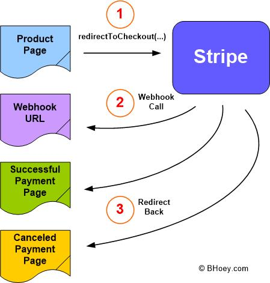
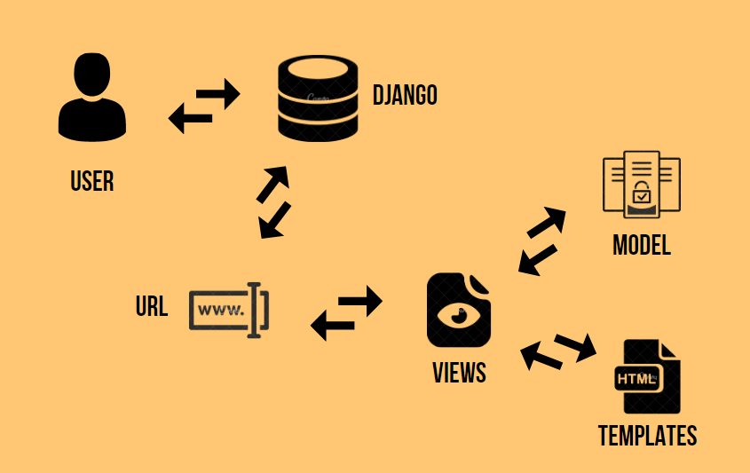

# How does it work?
The way this application works is best shown in the image below which will show the steps in the application's step by step architecture pattern.

The way Django as a framework works is shown below.

Now let's get into more details on how this all plays together by looking at the request/response lifecycle.

1) The user (client) will perform some action against a Django webserver gateway (default for Django in non-production) by either adding the item to cart of using the express checkout functionality.

2) The request uses the Django middleware that's linked to what's known as a router to call the appropriate view (displayed to the user as a `"/foo"` or `"/foo/bar"` link).

3) This view will then use the ORM to render and structure some data. In our case it's the following: name, price, file, url. Moreover, the ORM will call template tags to render the template.

4) Once this template is rendered it will be sent back to the client as a response using Django's middleware.

# What does it do?
This application has the functionality to add an item to a shopping cart, checkout the item, and pay for the product. Additionaly, there is a feature set that allows the user to checkout the item right away using an express checkout feature that only requires card information from the user. Finally, the user will see how much they paid and what their payment confirmation is.

# Which Stripe APIs does it use?
[Stripe Checkout](https://stripe.com/docs/payments/checkout), [Stripe Payments](https://stripe.com/docs/payments), and [Stripe Charges](https://stripe.com/docs/payments/charges-api).

# How you approached this problem.
This problem is one that was very clearly defined upfront and it was pretty simple to solve using off the shelf code. I knew that in this case it's just a POC and speed/TTI (time to implementation) is the most important thing rather than some hardcore scalable solution off of the bat since in reality startups care more about time versus scalability (assuming they're pre-PMF (product market fit)). I figured I'd use Django's MVC framework since I will be asked to add on additional features in a given timeframe in the next interview round so Django was the way to go. If I were approaching this for a production quality application I would have made significant overhaul changes to my choice of framework, etc. I explain this in the next section thouroughly.

# Why you picked the language/framework that you did.
I chose Django for the following reasons:

- Better for a relational database since ACID properties are VITAL for payments infrastructure.

- Speed to implement the solution was the primary problem to solve (time is money for startups).

- Out of the box security features that Django provide are great for a company that aren't security experts and want to use a middleware "plug and play".

I would chose Nodejs for the following reasons:

- Async nature of the framework yields 5x faster due to the underlying Chrome V8 engine. 

- Async give the ability to scale way better than Django. This is a huge factor for a promising startup.

My $0.02:

- These tradeoffs don't matter until a certain scale that 95% of all startups will never hit. These issues are trivial to the real underlying issues that startups face which are (i) get PMF, (ii) get users, and most importantly (iii) make money. As a result of this I chose to use a tool that's fast to implement, ideal for payments out of the box, and has easy "lego pieces" for security measures.

# What would I do differently if I were building a production grade product?
- I would use the following "homegrown" tech stack on the backend: Nodejs, Express, MySQL (for the ACID properties), Redis (if we needed caching for say the top 80% of repeat customers actions), Docker (to separate the client, server, database w/ persistent storage), and Kubernetes for scaling up from a single pod (the original instance upon deployment) and also doing things like load balancing.

- I would NOT store my `STRIPE_PUBLIC_KEY` nor `STRIPE_SECRET_KEY` in plaintext in the GitHub code. I would store those in .env file that gets baked into a Docker image for production.

- I would utilize AWS for as many pieces of this problem as possible so the statup could focus primarily on shipping features, not building out infra.

- I would ensure that there's an enterprise grade backup, monitoring, and logging plan/solution in place.